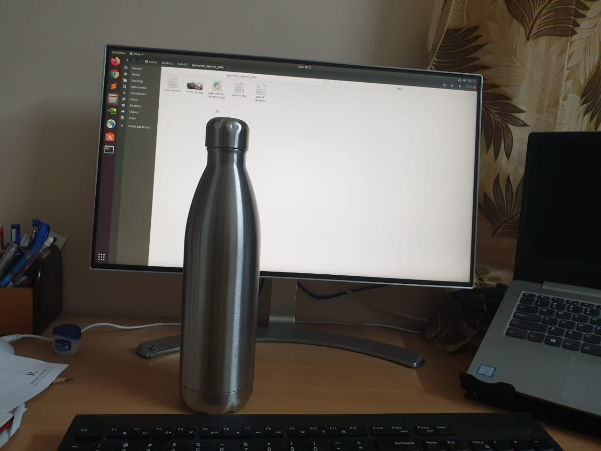
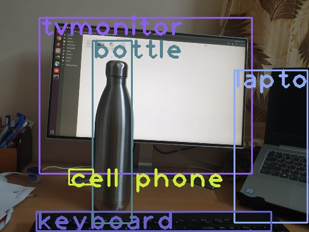

# EVA4 Assignment 13 - Harsha Vardhan

**Team Members**

- Tusharkant Biswal (Tusharkanta_biswal@stragure.com) 
- V N G Suman Kanukollu (sumankanukollu@gmail.com)
- Harsha Vardhan (harshavardhan.ma@gmail.com)
- Praveen Raghuvanshi (praveenraghuvanshi@gmail.com)

### Assignment 13 - Part 1

OpenCV Yolo: [SOURCE (https://pysource.com/2019/06/27/yolo-object-detection-using-opencv-with-python/)

1. Take an image of yourself, holding another object which is there in COCO data set (search for COCO classes to learn).
2. Run this above yolo_object_detection.py in Part1 folder. 

#### Solution

- [Github Directory](https://github.com/HarshaVardhanMA/EVA4.0/tree/master/Session13/Part1)

- Original Image

  

- Objects Detected in Image

  

### Assignment 13 - Part 2

Training Custom Dataset on Colab for YoloV3

1. Refer to this Colab File: [LINK ](https://colab.research.google.com/drive/1LbKkQf4hbIuiUHunLlvY-cc0d_sNcAgS)
2. Refer to this GitHub [Repo](https://github.com/theschoolofai/YoloV3)
3. Collect a dataset of 500 images and annotate them. **Please select a class for which you can find a YouTube video as well.** Steps are explained in the readme.md file on GitHub.
4. Once done:
   1. [Download ](https://www.y2mate.com/en19) a very small (~10-30sec) video from youtube which shows your class. 
   2. Use [ffmpeg](https://en.wikibooks.org/wiki/FFMPEG_An_Intermediate_Guide/image_sequence) to extract frames from the video. 
   3. Upload on your drive (alternatively you could be doing all of this on your drive to save upload time)
   4. Inter on these images using detect.py file. **Modify** detect.py file if your file names do not match the ones mentioned on GitHub. 
      `python detect.py --conf-thres 0.3 --output output_folder_name`
   5. Use [ffmpeg](https://en.wikibooks.org/wiki/FFMPEG_An_Intermediate_Guide/image_sequence) to convert the files in your output folder to video
   6. Upload the video to YouTube. 
5. Share the link to your GitHub project with the steps as mentioned above
6. Share the link of your YouTube video
7. Share the link of your YouTube video on LinkedIn, Instagram, etc! You have no idea how much you'd love people complimenting you! 

#### Solution

[Github Directory](https://github.com/HarshaVardhanMA/EVA4.0/tree/master/Session13/Part2)

- This assignment is done as a GROUP and has same submission by all team members. 

- Team members are mentioned at the top

- Assignment has been executed on a local machine and colab is not used.

- We took object detection of cartoon character '**Tom**' from Tom and Jerry tales

- Extracted frames from video for dataset

- Manually annotated 1466 images covering whole body of character '**Tom**'

- Epochs: 300 

- Training Time: 07.541 hours

- Classes : 1 - **tom**

- Steps
  - Made changes to the cfg file
    - Search for 'filters=255' (you should get entries entries). Change 255 to 18 = (4+1+1)*3
    - Search for 'classes=80' and change all three entries to 'classes=1'
    - burn_in to 100
    - max_batches to 5000
    - steps to 4000,4500
  - custom.names had only 'tom' as class.
  - custom.txt has path to all images
  - Trained model for 300 epochs 
  - Ran detect.py to generate frames for predicted bounding boxes
  - Tested model with last.pt file generated on new video and uploaded it to Youtube.
  
- Resources
  - Dataset
    - [Images](Part2/data/customdata/images)
    - [Labels](Part2/data/customdata/labels)
    
  - Custom YoloV3 code repository
  
  - Sample True Bounding Box
  
  - Sample Predicted Bounding Box
  
  - [Youtube Video (Duration: 02:34 mins)](https://www.youtube.com/watch?v=7_lH-jFB0Cg)
  
    
  
  - [Logs](Part2/train.log)
  
  
  
- Submission
  - Share the link to your GitHub project with the steps as mentioned above (for YoloV3 training on Colab)
  - Share the link of your YouTube video (your object annotated by your YoloV3 trained model) - https://www.youtube.com/watch?v=7_lH-jFB0Cg

- Credits:

  - [The School of AI (YoloV3)](https://github.com/theschoolofai/YoloV3)
